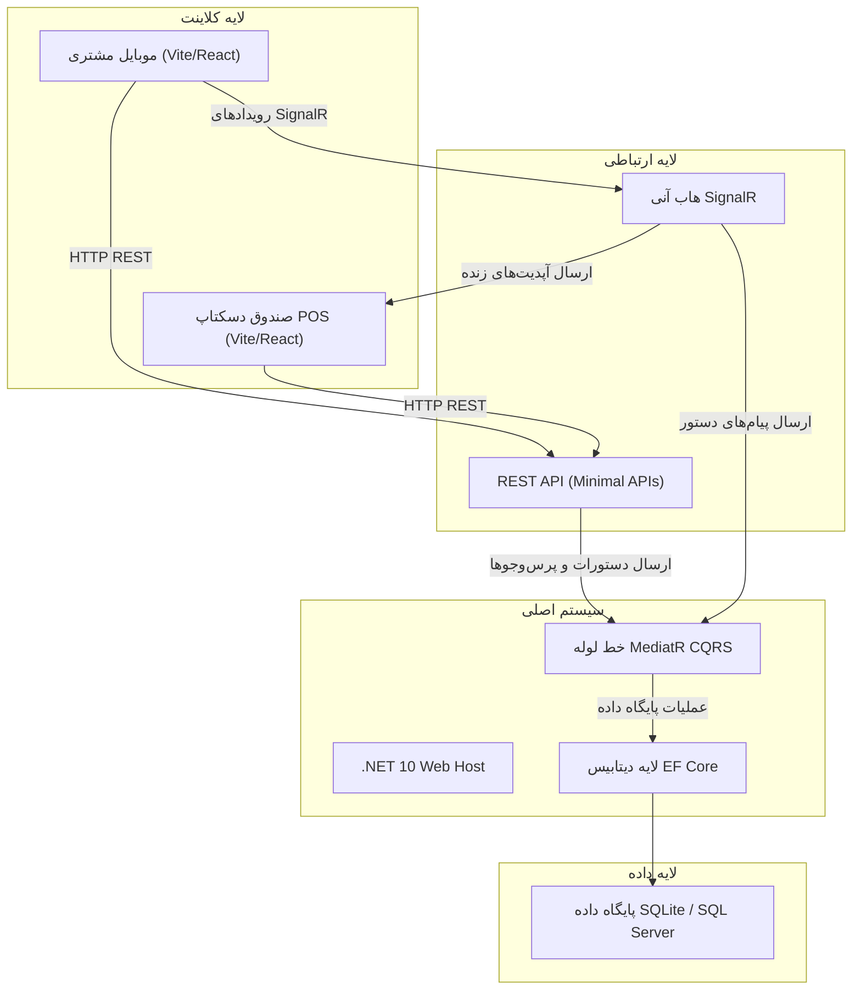
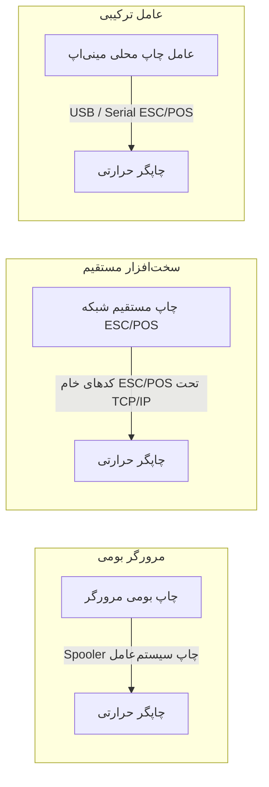

# پروپوزال تجاری: سیستم POS کافه و اتوماسیون سفارش‌دهی حضوری

## خلاصه مدیریتی

این پروپوزال، طرح پیاده‌سازی یک پلتفرم مدیریت عملیاتی و سفارش‌دهی دیجیتال مدرن، سبک و بسیار سریع (Responsive) را برای یک کافه-رستوران تک‌شعبه‌ای تشریح می‌کند.

در بخش سنتی غذا و نوشیدنی (F&B)، گلوگاه‌های خدمات‌رسانی و چالش‌های اداری-اجرایی اغلب بر رضایت مشتریان تأثیر منفی می‌گذارند. این سیستم با معرفی منوی موبایلی خودخدمت (Self-service) برای مشتریان و یک داشبورد دسکتاپ آنی و زنده برای کارکنان، جریان‌های کاری سفارش‌دهی را خودکار کرده، خطاهای ارتباطی بین سالن‌کاران و کارکنان آشپزخانه را به حداقل می‌رساند و زیرساخت پایگاه داده را برای گزارش‌های مالی آینده پایه‌ریزی می‌کند.

---

## ۱. اهداف اصلی و ارزش پیشنهادی

* **ارتقای تجربه مشتری**: مشتریان با اسکن یک کد QR اختصاصی برای هر میز توسط موبایل خود، فوراً به منوی دیجیتال دسترسی پیدا کرده، سفارش‌های سفارشی خود را ثبت و درخواست کمک ارسال می‌کنند؛ امری که زمان انتظار برای دریافت منوی فیزیکی یا ثبت سفارش را از بین می‌برد.
* **ساده‌سازی جریان‌های کاری عملیاتی روزانه**: سفارش‌ها فوراً به صفحات بهینه‌سازی‌شده برای دسکتاپ جهت نمایش به باریستاها و کارکنان آشپزخانه ارسال می‌شوند، که این امر سردرگمی ناشی از فیش‌های کاغذی و پیگیری دستی سفارش‌ها را حذف می‌کند.
* **کنترل عملیاتی**: رهگیری آنی وضعیت میزهای سالن و اعلان‌های فراخوانی گارسون، پاسخگویی فوری به درخواست‌های مشتریان را تضمین می‌کند.
* **پایه‌ریزی بستر تحلیل داده‌ها**: سیستم با ثبت تاریخچه ساختاریافته تراکنش‌ها (سفارش‌ها، فروش آیتم‌ها، تخفیف‌ها و روش‌های پرداخت)، یک پایگاه داده منسجم را برای هوش تجاری آینده، پیش‌بینی فروش و حسابداری مالی تضمین می‌کند.

---

## ۲. معماری فنی سیستم

این پلتفرم با استفاده از فناوری‌های مدرن و استاندارد صنعت مهندسی شده است که عملکرد بالا، تأخیر کم و نگهداری آسان را تضمین می‌کنند.

### جزئیات کامپوننت‌ها

* **بک‌اند (C# .NET 10 و معماری پاک)**: تفکیک وظایف (Division of concerns) با جداسازی نهادهای دامنه (Domain entities)، هندلرهای برنامه MediatR CQRS (جداسازی مسئولیت دستور و پرس‌وجو) و لایه میزبانی Minimal API. این امر تضمین می‌کند که منطق کسب‌وکار (Business Logic) ماژولار و قابل تست باقی بماند.
* **فرانت‌اند (Vite، React و Zustand)**: یک کلاینت وب سبک و بهینه‌سازی‌شده برای دسکتاپ ویژه کارکنان، همراه با منوی بهینه‌سازی‌شده برای موبایل ویژه مشتریان. مدیریت وضعیت (State management) از طریق Zustand انجام می‌شود که به‌روزرسانی‌های سریع و مبتنی بر وضعیت را در رابط کاربری فراهم می‌سازد.
* **موتور ارتباط آنی (ASP.NET Core SignalR)**: اعلان‌های فوری کلاینت به سرور را امکان‌پذیر می‌کند. فعالیت‌های مشتری (مانند ثبت سفارش یا فراخوانی گارسون) بدون نیاز به ارسال درخواست‌های مکرر (Polling)، بلافاصله در داشبورد مدیریت دسکتاپ ظاهر می‌شوند.

---

## ۳. جریان‌های کاری عملیاتی و یکپارچه‌سازی

### فرآیند تعامل مشتری (سفارش حضوری روی میز)

1. **دسترسی**: مشتری کد QR میز را اسکن می‌کند، که مسیر `/menu/{tableNumber}` را در مرورگر موبایل او باز می‌کند.
2. **انتخاب**: مشتری دسته‌بندی‌ها (قهوه، نوشیدنی‌های سرد، پیتزا و غیره) را مرور کرده و آیتم‌ها را به سبد خرید دیجیتال خود اضافه می‌کند.
3. **ثبت نهایی**: هنگام تسویه حساب، API یک سفارش در وضعیت «در انتظار» (`Pending`) را در پایگاه داده ثبت می‌کند و یک رویداد SignalR را به داشبورد کارکنان مخابره می‌نماید که باعث فعال شدن یک اعلان پاپ‌آپ بصری همراه با هشدار صوتی در پنل مدیریت می‌شود.
4. **فراخوانی گارسون**: مشتری می‌تواند در هر زمان دکمه «فراخوانی گارسون» را لمس کند؛ این کار یک هشدار صوتی آنی و اعلان بصری در پنل مدیریت ایجاد کرده و وضعیت میز را روی صفحه نمایش کارکنان به حالت چشمک‌زن درمی‌آورد.

### جریان کاری صندوق‌دار (POS) و کارکنان

1. **مدیریت آماده‌سازی**: سفارش‌ها بورد کانبان (Kanban) داشبورد زنده را پر می‌کنند. کارکنان وضعیت سفارش‌ها را از «در انتظار» (`Pending`) $\rightarrow$ «در حال آماده‌سازی» (`Preparing`) $\rightarrow$ «تکمیل‌شده» (`Completed`) تغییر می‌دهند.
2. **ویرایش سفارش**: صندوق‌داران می‌توانند سفارش‌های فعال را از طریق پایانه POS ویرایش کنند، تعداد را تغییر دهند، یادداشت اضافه کنند یا تخفیف‌های سفارشی اعمال نمایند.
3. **پرداخت‌ها**: هنگامی که مشتری آماده پرداخت است، این کار را در باجه صندوق انجام می‌دهد. پرداخت از طریق یک دستگاه کارت‌خوان فیزیکی پردازش می‌شود و صندوق‌دار سفارش را در سیستم به عنوان «پرداخت‌شده» علامت‌گذاری می‌کند.

---

## ۴. استراتژی چاپ فیش با سخت‌افزار

برای عملیات استاندارد در حوزه غذا و نوشیدنی، صورت‌حساب‌های فیزیکی و فیش‌های آشپزخانه ضروری هستند. چاپ رسید با استفاده از یک چاپگر حرارتی استاندارد فیش از طریق یکی از رویکردهای پیشنهادی زیر یکپارچه‌سازی خواهد شد:

* **گزینه الف: چاپ بومی تحت وب از طریق مرورگر (فاز اولیه پیشنهادی)**:
برنامه یک صفحه فیش حرارتی طراحی‌شده ۸۰ میلی‌متری (کامپوننت ThermalReceipt) را رندر می‌کند. هنگام اجرای فرمان چاپ، سیستم متد `window.print()` را فراخوانی کرده و قالب‌بندی را به درایور چاپگر بومی سیستم‌عامل واگذار می‌کند. این گزینه به هیچ یکپارچه‌سازی بومی (Native) نیاز ندارد و بلافاصله آماده استفاده است.
* **گزینه ب: چاپ مستقیم شبکه از طریق پروتکل ESC/POS (پیشنهاد سازمانی)**:
اگر چاپ خودکار در آشپزخانه مدنظر باشد، بک‌اند دستورات چاپ باینری خام ESC/POS را مستقیماً به آدرس IP محلی چاپگر حرارتی روی پورت 9100 ارسال می‌کند. این روش امکان چاپ فوری فیش را بدون باز شدن پنجره تایید چاپ مرورگر فراهم می‌سازد.

---

## ۵. استقرار و زیرساخت

برنامه به عنوان یک راهکار کانتینری‌شده (Containerized) با استفاده از داکر (Docker) بسته‌بندی می‌شود که نصب سریع و محیط اجرای پایدار را روی یک سرور لینوکس محلی یا ابری تسهیل می‌کند.

* **کانتینری‌سازی با داکر (Docker Containerization)**:
* فایل‌های Dockerfile چندمرحله‌ای (Multi-stage) بک‌اند C# را کامپایل کرده و دارایی‌های پروداکشن (Production Assets) فرانت‌اند React را می‌سازند.
* ابزار Docker Compose هر دو کانتینر میزبان برنامه و نمونه سرور پایگاه داده را به عنوان یک بسته شبکه‌ای واحد مدیریت می‌کند.

* **سازگاری با سرور**:
قابل استقرار روی توزیع‌های استاندارد لینوکس (Ubuntu/Debian) با حداقل نیازهای سخت‌افزاری. این سیستم می‌تواند به صورت حضوری در محل (روی یک دستگاه محلی که به عنوان سرور محلی عمل می‌کند) اجرا شود تا پایداری عملیاتی آفلاین را در زمان قطع اینترنت تضمین کند، یا اینکه روی یک سرور مجازی خصوصی (VPS) در فضای ابری قرار گیرد.

---

## ۶. بازگشت سرمایه (ROI) و مزایای استراتژیک

* **کاهش فشار کاری نیروی انسانی**: منوهای خودخدمت به کارکنان سالن اجازه می‌دهند تا به جای ثبت دستی سفارش‌ها، بر آماده‌سازی غذا/نوشیدنی و مهمان‌نوازی تمرکز کنند.
* **افزایش میانگین مبلغ هر فیش (Ticket Sizes)**: منوهای دیجیتال همراه با عکس‌های واضح و یادداشت‌های ساختاریافته، مشتری را به خرید بیشتر (Upselling) و سفارشی‌سازی آیتم‌ها ترغیب می‌کنند.
* **حذف خطاهای ثبت سفارش**: مشتری خودش سفارش را وارد می‌کند، که این امر خطاهای املایی یا اشتباهات انتقال اطلاعات توسط گارسون‌ها را از بین می‌برد.
* **سوابق مالی شفاف و دقیق**: ثبت آنی تراکنش‌ها مانع از کسری و هدررفت موجودی انبار (Inventory shrinkage) شده و مجموعه داده پایه مورد نیاز برای ویژگی‌های آتی صورت‌حساب خودکار و حسابرسی را فراهم می‌کند.