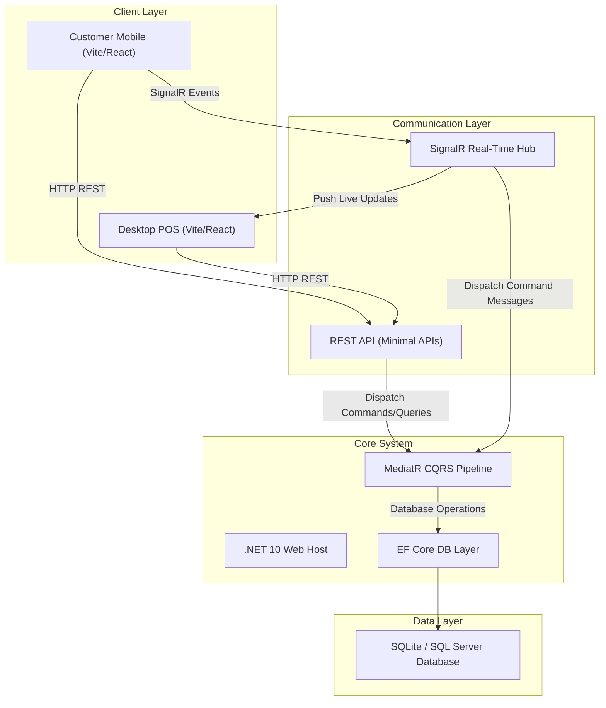
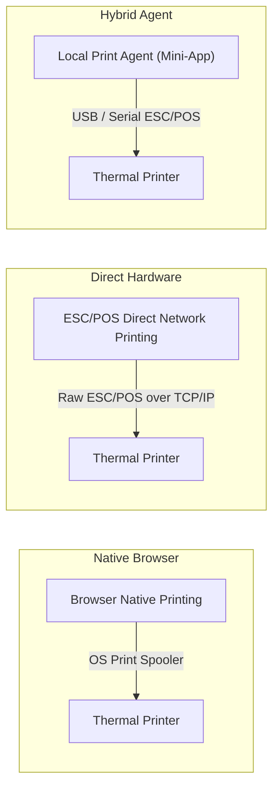

# Business Proposal: Cafe POS & On-Site Ordering Automation

## Executive Summary

This proposal outlines the implementation of a modern, lightweight, and highly responsive digital ordering and operational management platform for a single-location cafe-restaurant. 

In the traditional food and beverage (F&B) sector, service bottlenecks and administrative friction often impact customer satisfaction. By introducing a self-service mobile customer menu and a live real-time desktop dashboard for the staff, this system automates ordering workflows, minimizes communication errors between front-of-house and kitchen staff, and lays the database foundation for future financial reporting.

---

## 1. Core Objectives & Value Proposition

*   **Elevate the Customer Experience**: Customers scan a table-specific QR code using their own mobile devices to instantly access the digital menu, place custom orders, and request assistance—eliminating wait times for physical menus or order taking.
*   **Streamline Daily Operational Workflows**: Orders are dispatched instantly to desktop-optimized screens for baristas and kitchen staff, eliminating paper ticket confusion and manual order tracking.
*   **Operational Control**: Real-time dining table status tracking and waiter call notifications ensure immediate responsiveness to customer requests.
*   **Lay the Foundation for Analytics**: By capturing structured transaction history (orders, item sales, discounts, and payment methods), the system secures a clean database for future business intelligence, sales forecasting, and financial accounting.

---

## 2. Technical System Architecture

The platform is engineered using modern, industry-standard technologies that guarantee high performance, low latency, and ease of maintainability.

### Component Details
*   **Backend (C# .NET 10 & Clean Architecture)**: Division of concerns separating Domain entities, MediatR CQRS (Command Query Responsibility Segregation) application handlers, and a Minimal API hosting layer. This ensures the business logic remains modular and testable.
*   **Frontend (Vite, React & Zustand)**: A lightweight, desktop-optimized web client for staff and mobile-optimized customer-facing menu. State management is handled through Zustand, allowing fast, state-driven UI updates.
*   **Real-Time Engine (ASP.NET Core SignalR)**: Enables instant client-to-server notifications. Customer activities (submitting an order, requesting a waiter) immediately appear on the desktop admin dashboard without polling.

---

## 3. Operational Workflows & Integration

### Customer Journey (On-Site Table Ordering)
1.  **Access**: The customer scans the table's QR code, which opens the route `/menu/{tableNumber}` on their mobile browser.
2.  **Selection**: The customer browses the categories (Coffee, Cold Drinks, Pizza, etc.) and adds items to their digital cart.
3.  **Submission**: On checkout, the API registers a `Pending` order in the database and broadcasts a SignalR event to the staff dashboard, triggering a visual popup notification accompanied by an audible alert (sound) in the Admin panel.
4.  **Waiter Calling**: The customer can tap the "Call Waiter" button at any time, which triggers a real-time sound alert and visual notification in the Admin panel, flashing the table's status on the staff screen.

### Cashier POS & Staff Workflow
1.  **Fulfillment Management**: Orders populate the Live Dashboard Kanban board. Staff transition orders from `Pending` $\rightarrow$ `Preparing` $\rightarrow$ `Completed`.
2.  **Order Adjustment**: Cashiers can edit active orders from the POS terminal, adjust quantities, add notes, or apply customized discounts.
3.  **Payments**: When the customer is ready to pay, they do so at the cashier counter. Payment is processed via a physical card terminal, and the cashier marks the order as paid in the system.

---

## 4. Hardware Receipt Printing Strategy

For standard F&B operations, physical invoices and kitchen tickets are essential. Receipt printing will be integrated using a standard thermal receipt printer through one of the following recommended approaches:

*   **Option A: Web-Native Browser Printing (Recommended Initial Phase)**:
    The application renders an 80mm styled thermal receipt page (ThermalReceipt component). When printing is triggered, the system invokes `window.print()`, delegating the formatting to the native OS printer driver. This option requires no native integrations and works out of the box.
*   **Option B: ESC/POS Direct Network Printing (Enterprise Recommendation)**:
    If kitchen-auto printing is required, the backend sends raw ESC/POS binary print commands directly to the thermal printer's local IP address on port 9100. This enables instant ticket printing without browser print-dialog prompts.

---

## 5. Deployment & Infrastructure

The application will be packaged as a containerized solution using Docker, facilitating rapid installation and consistent execution environment on a local or cloud Linux server.

*   **Docker Containerization**:
    *   Multi-stage Dockerfiles compile the C# backend and build the React frontend production assets.
    *   Docker Compose manages both the application host container and the database server instance as a single network bundle.
*   **Server Compatibility**:
    Deployable on standard Linux distributions (Ubuntu/Debian) with minimal system requirements. It can run on-site (on a local machine acting as a local server) to guarantee offline operational resilience during internet outages, or on a private virtual server in the cloud.

---

## 6. ROI & Strategic Benefits

*   **Reduced Labor Strain**: Self-service menus allow the floor staff to focus on food/beverage preparation and hospitality, rather than manual order taking.
*   **Higher Ticket Sizes**: Digital menus with clear photography and structured notes encourage upselling and item customization.
*   **Elimination of Order Errors**: The customer inputs their own order, eliminating spelling or transcription errors by wait staff.
*   **Clean Financial Records**: Real-time logging of transactions eliminates inventory shrinkage and provides the base dataset required for future automated billing and audit features.
