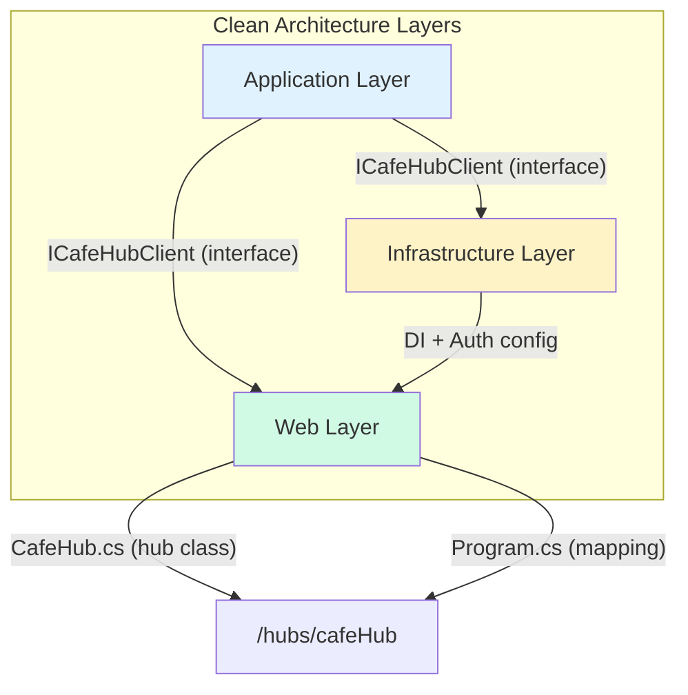
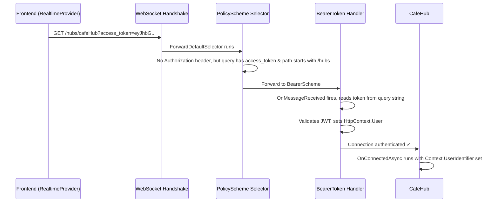
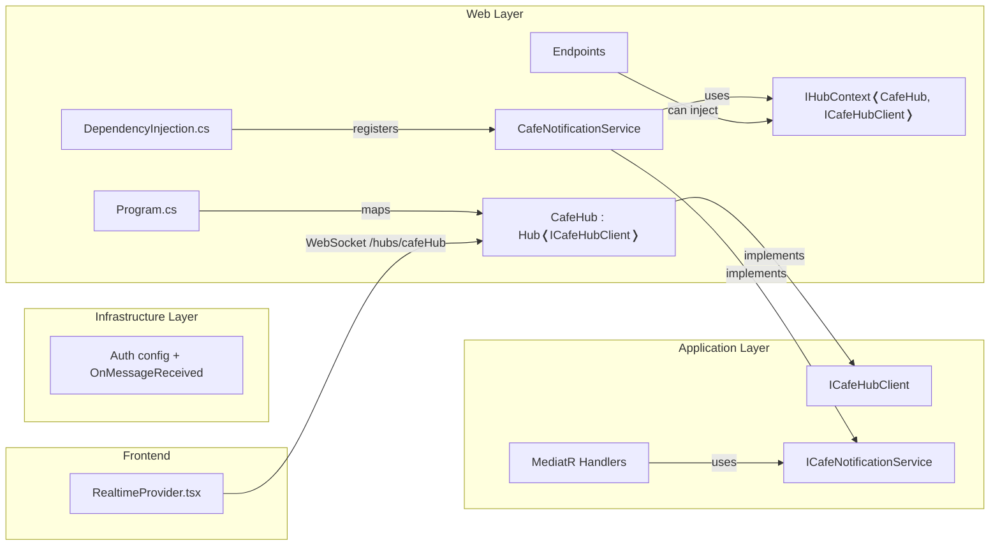

# SignalR Backend Implementation Roadmap

> [!NOTE]
> This guide is tailored specifically to your CafePos Clean Architecture project. All namespaces, file paths, and patterns match your existing codebase. Follow the steps in order.

---

## Overview

Your frontend (`RealtimeProvider.tsx`) connects to `/hubs/cafeHub` and listens for two events: `ReceiveNewOrder` and `WaiterCalled`. The backend needs to:

1. Host a SignalR Hub at `/hubs/cafeHub`
2. Authenticate WebSocket connections using your existing JWT Bearer setup
3. Allow services/endpoints to broadcast events to connected admin clients



---

## Step 1 — Install the NuGet Package

SignalR server-side is included in `Microsoft.AspNetCore.App` (the shared framework) for .NET 10, so **you don't need to install any additional NuGet package** for the server.

> [!TIP]
> The package `Microsoft.AspNetCore.SignalR` is part of the shared framework starting from .NET Core 3.0+. You only need a separate NuGet package for advanced scenarios like Redis backplane (`Microsoft.AspNetCore.SignalR.StackExchangeRedis`).

---

## Step 2 — Define the Typed Hub Client Interface

Following Clean Architecture, the **interface** goes in the **Application layer** (so that Application-layer handlers can reference it without depending on Web/SignalR), and the **Hub class** goes in the **Web layer**.

### Create: `src/Application/Common/Interfaces/ICafeHubClient.cs`

```csharp
namespace CafePosBackend.Application.Common.Interfaces;

/// <summary>
/// Strongly-typed SignalR client contract.
/// Defines methods the server can invoke on connected clients.
/// Method names here MUST match the frontend's connection.on("...") registrations.
/// </summary>
public interface ICafeHubClient
{
    /// <summary>
    /// Notifies admin clients that a new order has been placed.
    /// Frontend listens via: connection.on('ReceiveNewOrder', handler)
    /// </summary>
    Task ReceiveNewOrder(NewOrderNotification orderDetails);

    /// <summary>
    /// Notifies admin clients that a customer is calling a waiter.
    /// Frontend listens via: connection.on('WaiterCalled', handler)
    /// </summary>
    Task WaiterCalled(string tableId);
}

/// <summary>
/// Payload for the ReceiveNewOrder event.
/// Shape must match what the frontend expects in handleNewOrder(orderDetails).
/// </summary>
public class NewOrderNotification
{
    public string TableId { get; set; } = string.Empty;

    // Add more fields as needed:
    // public Guid OrderId { get; set; }
    // public decimal TotalAmount { get; set; }
    // public List<string> Items { get; set; } = [];
}
```

**Why a typed interface?**
- **Compile-time safety**: You can't accidentally typo `"RecieveNewOrder"` — the compiler catches it.
- **Clean Architecture compliance**: Application-layer code (MediatR handlers) can depend on `ICafeHubClient` without referencing `Microsoft.AspNetCore.SignalR`.
- **IntelliSense**: Full autocomplete when broadcasting from any service.

---

## Step 3 — Create the Hub Class

### Create: `src/Web/Hubs/CafeHub.cs`

```csharp
using CafePosBackend.Application.Common.Interfaces;
using Microsoft.AspNetCore.Authorization;
using Microsoft.AspNetCore.SignalR;

namespace CafePosBackend.Web.Hubs;

/// <summary>
/// The main SignalR Hub for real-time café operations.
/// Hub<ICafeHubClient> gives us strongly-typed access to client methods.
/// </summary>
[Authorize]
public class CafeHub : Hub<ICafeHubClient>
{
    private readonly ILogger<CafeHub> _logger;

    public CafeHub(ILogger<CafeHub> logger)
    {
        _logger = logger;
    }

    public override async Task OnConnectedAsync()
    {
        var userId = Context.UserIdentifier;  // Comes from the JWT 'sub' or NameIdentifier claim
        var connectionId = Context.ConnectionId;

        _logger.LogInformation(
            "Client connected. UserId: {UserId}, ConnectionId: {ConnectionId}",
            userId, connectionId);

        // Add all authenticated admin/barista users to an "AdminDashboard" group
        // so you can broadcast specifically to admin clients.
        await Groups.AddToGroupAsync(connectionId, "AdminDashboard");

        await base.OnConnectedAsync();
    }

    public override async Task OnDisconnectedAsync(Exception? exception)
    {
        var userId = Context.UserIdentifier;
        var connectionId = Context.ConnectionId;

        _logger.LogInformation(
            "Client disconnected. UserId: {UserId}, ConnectionId: {ConnectionId}, Error: {Error}",
            userId, connectionId, exception?.Message);

        await Groups.RemoveFromGroupAsync(connectionId, "AdminDashboard");

        await base.OnDisconnectedAsync(exception);
    }

    // ─── Optional: Hub methods the CLIENT can invoke ───
    // Your frontend currently doesn't call any hub methods (receive-only),
    // but here's how you'd add one if needed in the future:

    // public async Task JoinTableGroup(string tableId)
    // {
    //     await Groups.AddToGroupAsync(Context.ConnectionId, $"Table_{tableId}");
    //     _logger.LogInformation("Connection {Id} joined Table_{Table}", Context.ConnectionId, tableId);
    // }
}
```

### Key design decisions:

| Decision | Reasoning |
|---|---|
| `Hub<ICafeHubClient>` (not `Hub`) | Gives `Clients.All.ReceiveNewOrder(...)` with full type safety instead of `Clients.All.SendAsync("ReceiveNewOrder", ...)` |
| `[Authorize]` attribute | Only authenticated users can connect — matches the frontend sending the JWT token |
| `Groups.AddToGroupAsync` | Lets you broadcast to all admin dashboard clients without tracking individual connections yourself |

---

## Step 4 — Configure Authentication for WebSocket Token

> [!IMPORTANT]
> **This is the most critical step.** WebSockets **cannot send custom HTTP headers** after the initial handshake. The SignalR client library sends the JWT token as a **query string parameter** (`?access_token=xxx`). Your backend must be configured to read it from there.

### Modify: `src/Infrastructure/DependencyInjection.cs`

You need to add an `OnMessageReceived` event to your existing `.AddBearerToken()` configuration:

```diff
 builder.Services.AddAuthentication(options =>
 {
     options.DefaultScheme = "Identity_Combined";
 })
 .AddPolicyScheme("Identity_Combined", "Identity_Combined", options =>
 {
     options.ForwardDefaultSelector = context =>
     {
         var authHeader = context.Request.Headers["Authorization"].ToString();
         if (authHeader.StartsWith("Bearer ", StringComparison.OrdinalIgnoreCase))
         {
             return IdentityConstants.BearerScheme;
         }
+
+        // SignalR sends the token as a query string parameter
+        // because WebSockets can't send HTTP headers after the handshake.
+        if (context.Request.Query.ContainsKey("access_token") &&
+            context.Request.Path.StartsWithSegments("/hubs"))
+        {
+            return IdentityConstants.BearerScheme;
+        }
+
         return IdentityConstants.ApplicationScheme;
     };
 })
-.AddBearerToken(IdentityConstants.BearerScheme)
+.AddBearerToken(IdentityConstants.BearerScheme, options =>
+{
+    options.Events = new()
+    {
+        OnMessageReceived = context =>
+        {
+            // Read the token from the query string for SignalR requests
+            var accessToken = context.Request.Query["access_token"];
+            var path = context.HttpContext.Request.Path;
+
+            if (!string.IsNullOrEmpty(accessToken) &&
+                path.StartsWithSegments("/hubs"))
+            {
+                context.Token = accessToken;
+            }
+
+            return Task.CompletedTask;
+        }
+    };
+})
 .AddIdentityCookies();
```

### What this does, step by step:



1. **PolicyScheme selector** — Detects SignalR requests (no `Authorization` header but `access_token` in query string + path starts with `/hubs`) and routes them to the `BearerScheme`.
2. **OnMessageReceived** — Extracts the token from the query string and sets it on the authentication context *before* the handler tries to validate it.
3. **Path check** (`/hubs`) — This ensures we only do query-string token extraction for hub endpoints, not for regular API calls (security best practice).

---

## Step 5 — Register SignalR & Map the Hub

### 5a. Register the SignalR service

#### Modify: `src/Web/DependencyInjection.cs`

```diff
 public static void AddWebServices(this IHostApplicationBuilder builder)
 {
     builder.Services.AddDatabaseDeveloperPageExceptionFilter();

     builder.Services.AddScoped<IUser, CurrentUser>();

     builder.Services.AddHttpContextAccessor();

     builder.Services.AddExceptionHandler<ProblemDetailsExceptionHandler>();

     // Customise default API behaviour
     builder.Services.Configure<ApiBehaviorOptions>(options =>
         options.SuppressModelStateInvalidFilter = true);

     builder.Services.AddEndpointsApiExplorer();

     builder.Services.AddOpenApi(options =>
     {
         options.AddOperationTransformer<ApiExceptionOperationTransformer>();
         options.AddOperationTransformer<IdentityApiOperationTransformer>();
     });

     builder.Services.AddCors();
+
+    // Register SignalR services
+    builder.Services.AddSignalR(options =>
+    {
+        options.EnableDetailedErrors = builder.Environment.IsDevelopment();
+        options.KeepAliveInterval = TimeSpan.FromSeconds(15);
+        options.ClientTimeoutInterval = TimeSpan.FromSeconds(30);
+    });
 }
```

### 5b. Fix CORS for WebSockets & Map the Hub endpoint

#### Modify: `src/Web/Program.cs`

> [!WARNING]
> Your current CORS uses `.AllowAnyOrigin()`, which **is incompatible with SignalR**. SignalR requires `.AllowCredentials()`, and `.AllowCredentials()` cannot be combined with `.AllowAnyOrigin()`. You must switch to explicit origins.

```diff
+using CafePosBackend.Web.Hubs;
 using CafePosBackend.Infrastructure.Data;
 using Scalar.AspNetCore;

 var builder = WebApplication.CreateBuilder(args);

 // Add services to the container.
 builder.AddServiceDefaults();

 builder.AddKeyVaultIfConfigured();
 builder.AddApplicationServices();
 builder.AddInfrastructureServices();
 builder.AddWebServices();

 var app = builder.Build();

 // Configure the HTTP request pipeline.
 if (app.Environment.IsDevelopment())
 {
     await app.InitialiseDatabaseAsync();
 }
 else
 {
     app.UseHsts();
 }

 app.UseHttpsRedirection();
-app.UseCors(static builder =>
-    builder.AllowAnyMethod()
-        .AllowAnyHeader()
-        .AllowAnyOrigin());
+app.UseCors(static corsBuilder =>
+    corsBuilder
+        .AllowAnyMethod()
+        .AllowAnyHeader()
+        .AllowCredentials()                // Required for SignalR WebSockets
+        .SetIsOriginAllowed(_ => true));   // Allows any origin while still using credentials
+                                           // For production, replace with specific origins:
+                                           // .WithOrigins("https://yourdomain.com")

 app.UseFileServer();

+app.UseAuthentication();
+app.UseAuthorization();

 app.MapOpenApi();
 app.MapScalarApiReference();

 app.UseExceptionHandler(options => { });


 app.MapDefaultEndpoints();
 app.MapEndpoints(typeof(Program).Assembly);

+// Map SignalR Hub endpoint
+app.MapHub<CafeHub>("/hubs/cafeHub");

 app.MapFallbackToFile("index.html");

 app.Run();
```

> [!IMPORTANT]
> **`UseAuthentication()` and `UseAuthorization()` must come BEFORE `MapHub<CafeHub>()`** in the middleware pipeline. If they are missing or placed after, the `[Authorize]` attribute on the Hub will not work, and `Context.UserIdentifier` will always be null.

### Why `.SetIsOriginAllowed(_ => true)` instead of `.AllowAnyOrigin()`?

| Method | Allows Credentials | Works with SignalR |
|---|---|---|
| `.AllowAnyOrigin()` | ❌ No (throws at runtime) | ❌ |
| `.WithOrigins("https://...")` | ✅ Yes | ✅ |
| `.SetIsOriginAllowed(_ => true)` | ✅ Yes | ✅ (development shortcut) |

For **production**, replace with `.WithOrigins("https://your-actual-domain.com")`.

---

## Step 6 — Broadcasting from Your Services & Endpoints

This is where SignalR becomes useful: **you don't broadcast from the Hub class itself**. You broadcast from your existing MediatR handlers, services, or Minimal API endpoints using `IHubContext<THub, TClient>`.

### Pattern A: From a MediatR Command Handler (Recommended)

This is the cleanest approach for your Clean Architecture. When an order is created, the handler broadcasts.

#### Example: `src/Application/Orders/Commands/CreateOrder/CreateOrderCommandHandler.cs`

```csharp
using CafePosBackend.Application.Common.Interfaces;
using Microsoft.AspNetCore.SignalR;

namespace CafePosBackend.Application.Orders.Commands.CreateOrder;

public class CreateOrderCommandHandler : IRequestHandler<CreateOrderCommand, Guid>
{
    private readonly IApplicationDbContext _context;
    private readonly IHubContext<CafeHub, ICafeHubClient> _hubContext;

    public CreateOrderCommandHandler(
        IApplicationDbContext context,
        IHubContext<CafeHub, ICafeHubClient> hubContext)
    {
        _context = context;
        _hubContext = hubContext;
    }

    public async Task<Guid> Handle(CreateOrderCommand request, CancellationToken cancellationToken)
    {
        // 1. Create the order in the database
        var order = new Order { /* ... */ };
        _context.Orders.Add(order);
        await _context.SaveChangesAsync(cancellationToken);

        // 2. Broadcast to all connected admin clients
        await _hubContext.Clients.Group("AdminDashboard").ReceiveNewOrder(
            new NewOrderNotification
            {
                TableId = request.TableId,
                // OrderId = order.Id,
            });

        return order.Id;
    }
}
```

> [!WARNING]
> **Clean Architecture purist note**: The code above references `CafeHub` directly, which is in the Web layer. If you want the Application layer to have zero dependency on the Web layer, you should create an abstraction. See the "Clean Abstraction" pattern below.

### Pattern A (Clean Variant): Using an abstraction interface

#### Create: `src/Application/Common/Interfaces/ICafeNotificationService.cs`

```csharp
namespace CafePosBackend.Application.Common.Interfaces;

/// <summary>
/// Abstraction over the real-time notification mechanism.
/// Application layer depends on this; Web layer implements it via SignalR.
/// </summary>
public interface ICafeNotificationService
{
    Task NotifyNewOrder(NewOrderNotification orderDetails);
    Task NotifyWaiterCall(string tableId);
}
```

#### Create: `src/Web/Services/CafeNotificationService.cs`

```csharp
using CafePosBackend.Application.Common.Interfaces;
using CafePosBackend.Web.Hubs;
using Microsoft.AspNetCore.SignalR;

namespace CafePosBackend.Web.Services;

public class CafeNotificationService : ICafeNotificationService
{
    private readonly IHubContext<CafeHub, ICafeHubClient> _hubContext;

    public CafeNotificationService(IHubContext<CafeHub, ICafeHubClient> hubContext)
    {
        _hubContext = hubContext;
    }

    public async Task NotifyNewOrder(NewOrderNotification orderDetails)
    {
        await _hubContext.Clients.Group("AdminDashboard").ReceiveNewOrder(orderDetails);
    }

    public async Task NotifyWaiterCall(string tableId)
    {
        await _hubContext.Clients.Group("AdminDashboard").WaiterCalled(tableId);
    }
}
```

#### Register in: `src/Web/DependencyInjection.cs`

```diff
+    builder.Services.AddScoped<ICafeNotificationService, CafeNotificationService>();
```

#### Then use in your handler (no SignalR dependency):

```csharp
public class CreateOrderCommandHandler : IRequestHandler<CreateOrderCommand, Guid>
{
    private readonly IApplicationDbContext _context;
    private readonly ICafeNotificationService _notifications;

    public CreateOrderCommandHandler(
        IApplicationDbContext context,
        ICafeNotificationService notifications)
    {
        _context = context;
        _notifications = notifications;
    }

    public async Task<Guid> Handle(CreateOrderCommand request, CancellationToken ct)
    {
        var order = new Order { /* ... */ };
        _context.Orders.Add(order);
        await _context.SaveChangesAsync(ct);

        await _notifications.NotifyNewOrder(new NewOrderNotification
        {
            TableId = request.TableId,
        });

        return order.Id;
    }
}
```

### Pattern B: From a Minimal API Endpoint

If you want to broadcast directly from an endpoint (e.g., a customer calling a waiter):

```csharp
using CafePosBackend.Application.Common.Interfaces;
using CafePosBackend.Web.Hubs;
using Microsoft.AspNetCore.SignalR;

namespace CafePosBackend.Web.Endpoints;

public class CustomerActions : IEndpointGroup
{
    public static void Map(RouteGroupBuilder groupBuilder)
    {
        groupBuilder.MapPost(CallWaiter, "CallWaiter/{tableId}");
    }

    [EndpointSummary("Call a waiter to the table")]
    public static async Task<Ok> CallWaiter(
        string tableId,
        IHubContext<CafeHub, ICafeHubClient> hubContext)
    {
        await hubContext.Clients.Group("AdminDashboard")
            .WaiterCalled(tableId);

        return TypedResults.Ok();
    }
}
```

---

## Step 7 — Connection Management Patterns

### Broadcasting Targets

```csharp
// All connected clients (rarely what you want)
await _hubContext.Clients.All.ReceiveNewOrder(notification);

// All clients in a specific group (recommended for admin dashboard)
await _hubContext.Clients.Group("AdminDashboard").ReceiveNewOrder(notification);

// A specific user by their UserId claim
// (user can have multiple tabs/devices, all receive the message)
await _hubContext.Clients.User(userId).ReceiveNewOrder(notification);

// A specific connection (single browser tab)
await _hubContext.Clients.Client(connectionId).ReceiveNewOrder(notification);

// All except certain connections
await _hubContext.Clients.GroupExcept("AdminDashboard", excludedConnectionId)
    .ReceiveNewOrder(notification);
```

### Group Management (inside the Hub)

```csharp
// Add to group
await Groups.AddToGroupAsync(Context.ConnectionId, "AdminDashboard");

// Remove from group
await Groups.RemoveFromGroupAsync(Context.ConnectionId, "AdminDashboard");

// Role-based groups (in OnConnectedAsync)
var userRole = Context.User?.FindFirst(ClaimTypes.Role)?.Value;
if (userRole == "admin")
{
    await Groups.AddToGroupAsync(Context.ConnectionId, "Admins");
}
```

### How `Context.UserIdentifier` Works

SignalR resolves `UserIdentifier` from the `ClaimTypes.NameIdentifier` claim in the JWT. If your Identity setup uses a different claim for the user ID, implement a custom provider:

```csharp
// Only needed if UserIdentifier is not automatically resolved
using Microsoft.AspNetCore.SignalR;
using System.Security.Claims;

public class CustomUserIdProvider : IUserIdProvider
{
    public string? GetUserId(HubConnectionContext connection)
    {
        return connection.User?.FindFirst(ClaimTypes.NameIdentifier)?.Value;
    }
}

// Register in DependencyInjection.cs:
// builder.Services.AddSingleton<IUserIdProvider, CustomUserIdProvider>();
```

---

## Summary: Files to Create/Modify

| Action | File | Layer |
|---|---|---|
| ✨ Create | `src/Application/Common/Interfaces/ICafeHubClient.cs` | Application |
| ✨ Create | `src/Application/Common/Interfaces/ICafeNotificationService.cs` | Application |
| ✨ Create | `src/Web/Hubs/CafeHub.cs` | Web |
| ✨ Create | `src/Web/Services/CafeNotificationService.cs` | Web |
| ✏️ Modify | [src/Infrastructure/DependencyInjection.cs](file:///d:/programming/CleanArchitectureNet10/CafePosBackend/src/Infrastructure/DependencyInjection.cs) | Infrastructure |
| ✏️ Modify | [src/Web/DependencyInjection.cs](file:///d:/programming/CleanArchitectureNet10/CafePosBackend/src/Web/DependencyInjection.cs) | Web |
| ✏️ Modify | [src/Web/Program.cs](file:///d:/programming/CleanArchitectureNet10/CafePosBackend/src/Web/Program.cs) | Web |



---

## Quick Verification Checklist

After implementing, verify with these checks:

- [ ] App starts without errors
- [ ] Browser console shows `"Connected to SignalR cafeHub"` on admin dashboard
- [ ] Server logs show `"Client connected. UserId: ..., ConnectionId: ..."` 
- [ ] Calling the waiter endpoint triggers a toast notification in the admin dashboard
- [ ] Creating an order triggers the order toast
- [ ] Disconnecting (e.g., closing tab) logs `"Client disconnected..."` on the server
- [ ] Reconnecting (e.g., network flap) works automatically within ~30 seconds
